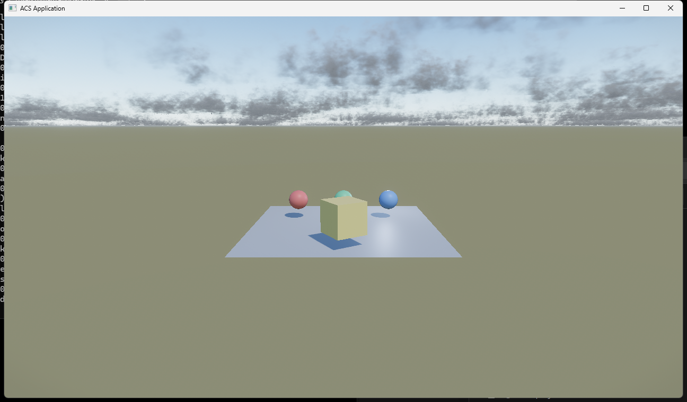

# acs_framework

**3D のゲームを、DXLib と同等以下の手数で作り始められて、DXLib より綺麗に映る。**

描く力は [ACS](https://github.com/mynameisGaku/ArtsCommonSystem) が持っている。この枠組みが
足すのは**手数の少なさ**だけで、機能を作り直すことはしない。



上の絵はサンプル 1 本 (`Source/AcsFramework_Sample/Scene/Demo3DScene.cpp`、約 250 行) の
出力。**空・太陽・影・環境光・雲がすべて 1 つの太陽から繋がっている。** 空は物理ベースの
大気を焼いたもので、それがそのまま環境光にもなるので、空と光が食い違わない。

## 動かす

必要なもの: Windows / Visual Studio 2022 以降 (C++20) / DirectX 12 が動く GPU。

```powershell
git clone https://github.com/mynameisGaku/acs_framework
cd acs_framework
.\Tools\FetchAcs.ps1                        # ACS の配布物を ThirdParty\acs へ
msbuild acs_framework.vcxproj /p:Configuration=Release /p:Platform=x64
.\x64\Release\acs_framework.exe
```

矢印キーで見回し、WASD で寄る。

> `FetchAcs.ps1` がまだ Release を落とせない段階なら、エンジンをローカルでビルドして
> `.\Tools\FetchAcs.ps1 -FromLocal C:\acs_dev` で持ってくる (`ThirdParty/acs/README.md`)。

## 何ができるか

| | |
|---|---|
| 3D を置く | `CModel3DSpawner`、FBX の取り込み、材質 (metallic / roughness) |
| 動かす | `SetPosition` / `RotateDeg` / `LookAt` / `MoveToward`、骨アニメーション |
| 見た目 | 物理大気・ボリューム雲・影・IBL・遮蔽 (SSAO)・間接光 (SSGI)・反射 (SSR)・霧・トーンマップ |
| 3D 演出 | `AEffect3DScene`、Effekseer、depth 遮蔽、HDR・bloom への自動合成 |
| 当てる | 線を飛ばして当たったノードを返す (`CScenePicker`) |
| 土台 | 起動・場面遷移・アセット・音・セーブ・設定・入力・多言語・決定性・開発支援 |

詳しくは [`Docs/ROADMAP.md`](Docs/ROADMAP.md)。**v1.0.0 で何を入れて何を入れないか**もそこに書いてある。

## 書き味

```cpp
// 置く
FModel3DSpawnParams Ball = FModel3DSpawnParams::FromPrimitive( EMeshPrimitive3D::Sphere, FVec3{ 0, 1, 0 } );
Ball.Roughness = 0.2f;
CModel3DSpawner::SpawnInto( Root(), Ball );

// FBX を置く (Assets からの相対名)
FModel3DSpawnParams Model = FModel3DSpawnParams::FromMesh( FStringView( "Models/Robot.fbx" ), Position );
CModel3DSpawner::SpawnInto( Root(), Model, Assets->Models() );

// 動かす
Node->RotateDeg( FVec3{ 0, 90.0f * DeltaSeconds, 0 } );
Node->MoveToward( Target, Speed * DeltaSeconds );
Node->LookAt( Target );

// 当てる
const FSceneRayHit Hit = CScenePicker::Raycast( Root(), FSceneRay::FromScreen( Camera, MouseX, MouseY, W, H ) );

// 近くの物から跳ね返る色を足す
GlobalIllumination().Intensity = 0.75f;

// 3D effectを出す (classの基底はAEffect3DScene)
PlayEffect3D( FStringView( "Effects/hit.efkefc" ), FVec3{ 0, 1, 0 } );
```

## 素材

`Assets/` に置く。モデルは **FBX**。詳しくは [`Assets/README.md`](Assets/README.md)。

## 確かめる

```powershell
.\Tools\RunUnitTests.ps1                    # 窓も音も要らない単体テスト
.\Tools\RunSimulationDeterminismTest.ps1    # 記録と再生が一致するか
.\Tools\CaptureApp.ps1 -Out shot.png        # 起動して 1 枚撮って閉じる
```

**3D はテストだけでは分からない。** 光の向きを間違えても、影のパスが抜けても、行列が
転置していても、全部コンパイルは通ってテストも緑になる。出るのは「画がおかしい」だけ。
だから最後の 1 つがある。

## 構成

```
Source/
  AcsFramework_Core/   土台 (App / Assets / Audio / Scene / Text / Simulation ...)
  AcsFramework_Sample/ サンプルの場面
  Common/              どの層からも使う小物
  Debug/               開発支援 (DevConsole / HotReload / Perf / DebugTop)
  EntryPoint/          入口
Assets/                素材
Tools/                 ビルド・テスト・撮影・配布物の取得
Docs/                  ロードマップと画
```

各フォルダに README がある。**「なぜそうなっているか」はそちらに書いてある。**

## ライセンス

Apache-2.0 ([`LICENSE`](LICENSE))。ACS の配布物と同梱ライブラリのライセンスは
`ThirdParty/acs/Licenses/` に入る。
